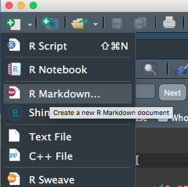
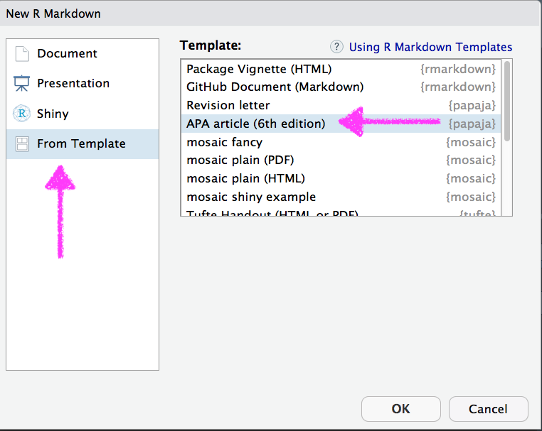

class: inverse
background-image:url(https://media.giphy.com/media/yoJC2A59OCZHs1LXvW/giphy.gif)
background-size:contain

```{r setup, include = FALSE}
library(tidyverse)
library(knitr)
opts_chunk$set(warning = FALSE, message = FALSE)
```

---
# Agenda 

### First two hours
- Introduction (8:00 - 8:45)
  - Who we are, who participants are and why they're here (15 min.) 
  - Reproducible research and literate programming (20 min.) <!-- DA -->
  - Conducting science in the public and in an open way & OSF (10 min.) <!-- JMR -->

--
- R Markdown (8:45 - 10:00)
  - Delineating code chunks from plain text (15 min.) <!-- JMR -->
  - Creating headers (5 min.) <!-- JMR -->
  - Creating lists and using other features of markdown (10 min.) <!-- DA -->
  - Whole-document and code chunk-specific options (15 min.) <!-- DA -->
  - Rendering and sharing documents in different formats (15 min.) <!-- JMR -->
  - Lab (practice) (15 min.)

---
class:inverse right
background-image:url(img/break.jpg)
background-size:cover

# Break (10:00 - 10:15)


---
# Last two hours
- Advanced R Markdown functionality (10:15 - 11:00 minutes)
  - Formatting tables (20 min.) <!-- DA -->
  - Creating manuscripts to submit for publication (via {papaja}; 25 min.)

- Use of git/GitHub for version control and collaboration (11:00 - 11:45)
  - Introduction to GitHub, RStudio interface, and GitKraken GUI (20
  min.) <!-- DA -->
  - Making changes, committing them, and pushing them to the repository (15 min.) <!-- DA -->
  - Use of GitHub (and ignoring specific files via `.gitignore`; 10 min.) <!-- JMR -->

- Wrap-up/ideas for next steps/staying in touch (11:45 - 12:00)

---
# #whoami

.pull-left[
* Research Assistant Professor: Behavioral Research and Teaching, University of
Oregon ([#goducks](https://twitter.com/search?q=%23goducks&src=typd))
* Dad (two daughters: 6 (almost 7) and 4)
* Primary areas of interest
  + 💗💗R💗💗 and computational research 
  + Open data, open science, and reproducible workflows
  + Growth modeling, achievement gaps, and variance
    between educational institutions (particularly spatially)
]

```{r, out.width = "350px", echo = FALSE, fig.align = "center"}
include_graphics("img/thefam.jpg")
```


---
# #whoami 2

.pull-left[
* Assistant Professor: STEM Education, University of Tennessee, Knoxville
* Also a Dad (one-year-old toddler!)
* Primary areas of interest
  + Data science in education (network analytic methods, experience sampling method, computational grounded theory)
  + Data science education (integrating data science and science education)
]

```{r, out.width = "350px", echo = FALSE, fig.align = "center"}

```

---
class: inverse bottom right
background-image: url(https://images.pexels.com/photos/1385627/pexels-photo-1385627.jpeg?auto=compress&cs=tinysrgb&dpr=2&h=750&w=1260)
background-size: cover

# #whoyouis

Introduce yourself
What's your prior experience with R/R Markdown and git/GitHub?
Why are you here?

---
class: da center middle
# This slide means we're 
# transitioning to Daniel

---
class: jmr center middle
# This slide means we're 
## transitioning to Josh


---
# Before we really get started
* Realize this is all going to be an intro
  
  + Covering a lot of content - that's purposeful
  
  + Idea is to give you exposure and some basic familiarity

--
* Resources to learn more
  
  + Daniel's class(es)
    + [Intro course](http://www.datalorax.com/vita/ds/ds1/)
    + [Data viz course](https://uo-datasci-specialization.github.io/c2-communicate_transform_data/)
    + [Functional programming](https://uo-datasci-specialization.github.io/c3-fun_program_r/)

  + [r4ds](https://r4ds.had.co.nz)

  + [R Markdown book](https://bookdown.org/yihui/rmarkdown/)

  + [(Developing) data science in education book](https://github.com/data-edu/data-science-in-education)
  
  + .gray[(plenty of others out there too)]


---
class: da center middle
# Reproducible Research and
# Literate Programming

<br>

### 8:15 - 8:30am


---
# A couple caveats 
* Much of what we're going to be discussing represents an ideal that we have only recently begun working towards.

--

* None of what we will talk about should be taken as a referendum on you or
  your current practices. However, we hope to help to convince you that you should be working toward the reproducible research ideal, and that, as a field, we should be moving toward reproducible research being the *minimal standard*.


--
* We will be focusing on reproducible research with R (obviously). Other
  options are available but, in our view, none are as clear, comprehensive, and easy to implement as the tools at your disposal through R.

---
# What is reproducible research?
* .bolder[Replicability] is the gold standard for research. Ideally, most
research would be verified through replication. 


--
* Reproducibility represents a .bolder[minimal] standard, which itself can aid replication (tremendously), by conducting and documenting the research sufficiently that .blue[an independent researcher could reproduce all the results from a study], provided the data were available


--
* Turns out this is a more difficult standard than we would generally like to admit.

---
# Why should we care?
* Reproducibility as an ethical standard

  + More transparency
  + More potential for results to be verified (and errors found/corrected)


--
* If your work **is not** reproducible, it is often not truly replicable.


--
* If your work **is** reproducible, then others have a "recipe" for replication.


---

# Are journal articles research? 
* Initially, we may think of journal articles as research, but really the
  research is everything that went into the article, not the article itself. 


--
* Some (Buckheit & Donoho, 2015) conceive of the article as the
  "advertisement".

--
* If all we have is the advertisement, can we really fully understand the
  steps and decisions made during the research?
    + In large-scale data analysis, the answer is generally "no".  

---
# Tangential benefits
Striving toward reproducible research will:
* Make your own code more efficient/easily interpretable

  + Can help with collaboration on a project

* Reduce errors

* Increase efficiency by not having to redo tables and figures with each tweak
  to a model.

---
# What does literate programming look like?
### What this workshop is about!

--
1. Start with a basic text document (not Word, text)


--
2. Use the text document to write your article


--
3. Embed code within the text document that corresponds to your analysis. Note this is not just copying the code in. The code should be live and what you're working with while conducting your research.


--
4. Render the document into a different format (pdf, html, etc.).
  + Select which code (if any) will be displayed
  + Build tables of results and plots to be produced


---
# End result
* Readers can then read the "advertisement", but if they are interested 
  in reproducing your results they can access the text file that contains the analysis code.

* Single product that has the advertisement and the research process embedded.

---
# Other reasons dynamic documents are useful
Outside of reproducibility, you may want to use R Markdown to:
* Produce slides

* Keep track of your analysis (notes, essentially), even if you end up using 
  something like Word

* Share code with others

* Quickly share results with others

* Produce professional looking data products


---
# Challenges
* Word is the industry standard (frustratingly so, to us) 
  + Word output is less than ideal
* Can be difficult when collaborating with others
* Some journal articles *require* papers submitted in Word
  + Potentially get a pdf to word converter, but still less than ideal
* Advanced features have a relatively steep learning curve

---
class: jmr center middle

# Open science and R Markdown basics 

### 8:35 - 8:45 am
---

# Open science and public work

.pull-left[
### Benefits
* Working in the public has potential benefits:
  * People know what your expertise is
  * Potential colleagues can reach out to you for collaborations
  * Allow others to build upon your work
  * Build a network
]

.pull-right[
### Dilemmas
* Working in the public has *some* potential dilemmas/drawbacks to manage:
  * Sometimes difficult to share pre-prints (due to copyright issues)
  * Getting 'scooped'
  * Often difficult to share data
]
---

# Open Science Framework

- Offers a platform in which you can store *private* data

- Has an Application Programming Interface (API) to connect with R

- Example: [https://osf.io/9ex7k/](https://osf.io/9ex7k/)

---

# R Markdown Basics

## 8:45 - 9:00

---
# R Markdown
From within your R Studio Project:


---
# First thing: Render!


---
class: inverse center middle
# Create new a R Markdown doc

### ### Try it out!


# YAML Front Matter

```
---
title: Example Markdown document
author: 
  - Daniel Anderson
  - : "2019-05-07"
---
```


* Three dashes before and after the YAML fields
* Case sensitive
* Many other fields are possible.
  + For example, you may want to include an `output:` argument (`pdf_document`,
    `html_document`, `word_document`). Must be specified as it is rendered, if
    not supplied.


---
# Example: Change syntax highlighting
The YAML will control a lot of how a document looks. For example, if you wanted to render with a different syntax highlighter:

.pull-left[
### Standard Rmd

```
---
title: "Doc Title"
output: pdf_document
---
```
]


.pull-right[
### kate 

```
---
title: "Doc Title"
output: 
  pdf_document:
    highlight: kate
---
```
]


---
# Code chunks versus text


---
# Code chunks

Start a code chunk with ` ```{r}`, then produce some r code, then close the

  chunk with three additional back ticks ` ``` `.


--

```{r add}
a <- 3
b <- 5

a + b * (exp(a)/b)
```

---
class: da center middle
# R Markdown basics 
## Headings, lists, chunk options, and inline code


### 9:00 - 9:30am


---
# Headings and Lists 

### Not R-lists

.pull-left[

```
# Level 1
## Level 2 
### Level 3 (etc.)
```

<br/>

```
 * Unordered list
  - inset
    + inset more
  - etc.

1. Ordered list
  a. blah blah
2. More stuff
```

]

.pull-right[


]


---
# echo and eval

.pull-left[

You can show code without evaluating it, using `eval = FALSE`. 

<div align = "left">

</div>


```{r rCalc2, eval = FALSE}
a + b * (exp(a)/b)
```
]

.pull-right[

Alternatively, you can evaluate the code without displaying it, using `echo = 
  FALSE`.

<div align = "left">

</div>

```{r plotExample, echo = FALSE, fig.width = 11}
data(mtcars)
with(mtcars, plot(mpg, hp, 
  xlab = "Miles Per Gallon", 
  ylab = "Horsepower",
  main = "Relation between Miles Per Gallon and Horsepower"))
```

]

---
# warning

```{r loadggplot, include = FALSE}
library(ggplot2)
theme_set(theme_minimal(base_size = 25))
```

### Warning = `FALSE`
```{r ggplotWarning2, warning = FALSE, fig.height = 5}
ggplot(msleep, aes(sleep_rem, sleep_total)) + 
  geom_point()
```
Warning is printed to the console when rendering.


---

### Warning = `TRUE`
```{r ggplotWarning1, fig.height = 6, warning = TRUE}
ggplot(msleep, aes(sleep_rem, sleep_total)) + 
  geom_point()
```

---
# Show errors

`error = TRUE`
```{r showErrors, fig.show = "hide", error = TRUE}
ggplot(msleep, aes(sleep, sleep_total)) + 
  geom_point()
```

--

<br>

If `error = FALSE`, the document won't render if it encounters an error.


---
# Message
Some functions will return messages. You may want to suppress these.

### message = `FALSE`
```{r messages2, message = FALSE, fig.height = 4}
ggplot(msleep, aes(sleep_total)) +
  geom_histogram()
```

---
# Message

### message = `TRUE`
```{r messages1, fig.height = 5, message = TRUE}
ggplot(msleep, aes(sleep_total)) +
  geom_histogram()
```

---
# include


The `include` argument is used to evaluate code that is not included in the
document at all. For example, when setting up your global options.


---
# Setting global options
Change the default behavior

```{r globalOps1, eval = FALSE}
opts_chunk$set(...) # insert options here
```

For example, you can set `echo = FALSE` and `fig.width = 6.5` and `fig.height = 8` with the following code.

```{r globalOps2, eval = FALSE}
opts_chunk$set(echo = FALSE, fig.width = 6.5, fig.height = 8)
```

This is most useful when producing a report for somebody who doesn't use R and has no use or knowledge of the code.


You can always override the global options within a particular chunk, e.g.

` ```{r, chunkName, echo = TRUE}` 

` ``` `

---
## Other things to consider setting globally:
* `warnings = FALSE`
* `message = FALSE`
* `errors = TRUE`
* `echo = FALSE`
* Caching options (next slides)


---
# More complete chunk options

```{r chunkOptions1, echo = FALSE, results = "asis", message = FALSE}
library(knitr)
library(kableExtra)
ops <- c("eval", "echo", "results", "warning", "error", "message", "include", 
            "tidy", "cache", "cache.comments", "dependson", "autodep", "fig.height/fig.width", "fig.show", "interval")
args <- c("logical", "logical", "markup, asis, hold, hide", 
            "logical", "logical", "logical", "logical", "logical", 
            "logical, 0:3", "logical", 
            "char, num", "logical", "numeric",
            "asis, hold, animate, hide", "numeric")
default <- c("TRUE", "TRUE", "markup", "TRUE", "TRUE", "TRUE", "TRUE",
              "FALSE", "FALSE", "NULL", "NULL", "FALSE", "7, 7", "asis", "1")
result <- c("Evaluate the code?", "Show the code?", "Render the results",
              "Print warnings?", "Preserve errors? (if FALSE, quit)", 
              "Print any messages?",
              "Include any of the code or output or code?", 
              "Tidy code? (see formatR package)", "Cache code chunks?",
              "Cache invalidated by comment changes?",
              "Current chunk depend on prior cached chunks?",
              "Depends determined automatically? ",
              "Height and width of figure", 
              "How the figure should be displayed", 
              "Animate speed")
kable(data.frame(ops, args, default, result)[1:8, ], 
      col.names = c("Options", "Arguments", "Default", "Result"),
      format = "html") %>%
  kable_styling()
```

---
# (and a few more)

```{r chunkOptions2, echo = FALSE, results = "asis", message = FALSE}
knitr::kable(data.frame(ops, args, default, result)[9:15, ], 
  col.names = c("Options", "Arguments", "Default", "Result"))
```

.footnote[For complete documentation, see http://yihui.name/knitr/options/]

---
# Inline code

A single back tick followed by `r` produces inline code to be evaluated.

<div align = "center">

</div>
<br>

This is an example of inline code, where I want to refer to the sum of `a` and
  `b`, which is `r a + b`.

This is *extremely* useful in writing reports. Never have to update any numbers in text, regardless of changes to your models or data (if you are careful about it).

---
# Real example


---
class: jmr center middle

# Rendering and documents

## 9:30 - 10:00am-
# Rendering R Markdown documents

## Modify the YAML
Get the same document to render to different formats by modifying the YAML to output HTML, PDF, and .docx

.pull-left[
### From

```
---
title: "My Document"
author: "Stephanie Lawson"
output: html_document
---
```
]


.pull-right[
### To

```
---
title: "My Document"
author: "Stephanie Lawson"
output: pdf_document
---
```
]

---

# Rendering to HTML

```
---
title: "My Document"
author: "Stephanie Lawson"
output: 
  html_document:
    toc: true
    toc_depth: 2
    toc_float: true
    number_sections: true
    higlight: kate
---
```

---

# Rendering to PDF

```
---
title: "My Document"
author: "Stephanie Lawson"
output: 
  pdf_document:
    toc: true
    number_sections: true
    higlight: kate
---
```

---

# Rendering to .docx

A key feature is the ability to use a reference document; see [here](https://bookdown.org/yihui/rmarkdown/word-document.html)

```
---
title: "My Document"
author: "Stephanie Lawson"
output: word_document
---
```


---
# {tinytex}
* Need a tex (pronounced tek) distribution
  + Our recommendation for this workshop with probably everything you'll ever need: 
    {tinytex}
    
--
```{r tinytex, eval = FALSE}
install.packages("tinytex")
tinytex::install_tinytex()
```

This is another amazing package by Yihui Xie. See more about it
[here](https://yihui.name/tinytex/)

---
class: da center middle
# R Markdown Tables 


<br>

### 9:40 - 9:50

---
class: inverse
background-image:url(https://github.com/rstudio/gt/raw/master/man/figures/logo.svg?sanitize=TRUE)
background-size: contain

---
# Overview
* New package (still very actively under development) by RStudio

* Really promising
  + Pipe-oriented
  + Beautiful tables easy
  + Spanner heads/grouping used to be a total pain - not so anymore
  + Renders to HTML/PDF without even thinking about it

* May run into bumps because of the active development

---
# Install

```{r install-gt, eval = FALSE}
remotes::install_github("rstudio/gt")
```

---
# The hard part
* Getting your data in the format you want a table in

* Utilize your `gather`/`spread` skills regularly

```{r flying}
library(fivethirtyeight)
flying
```

---
```{r flying2}
smry <- flying %>% 
  count(gender, age, recline_frequency) %>% 
  filter(!is.na(age),
         !is.na(recline_frequency)) %>% 
  spread(age, n) 

smry
```


---
# Turn into table
### Disclaimer 
These all look slightly different on the slides

.pull-left[
```{r gt1-echo, eval = FALSE}
library(gt)
smry %>% 
  gt()
```
]

.pull-right[
```{r gt1-eval, echo = FALSE}
library(gt)
smry %>% 
  gt()
```
]

---
## Add gender as a grouping variable

.pull-left[
```{r gt2-echo, eval = FALSE}
smry %>% 
  group_by(gender) %>% 
  gt()
```
]

.pull-right[
```{r gt2-eval, echo = FALSE}
smry %>% 
  group_by(gender) %>% 
  gt()
```
]

---
# Add a spanner head

```{r gt3-echo, eval = FALSE}
smry %>% 
  group_by(gender) %>% 
  gt() %>% 
  tab_spanner(label = "Age Range",
              columns = vars(`18-29`, `30-44`, `45-60`, `> 60`))
```

---
```{r gt3-eval, echo = FALSE}
smry %>% 
  group_by(gender) %>% 
  gt() %>% 
  tab_spanner(label = "Age Range",
              columns = vars(`18-29`, `30-44`, `45-60`, `> 60`))
```

---
# Change column names

```{r gt4-echo, eval = FALSE}
smry %>% 
  group_by(gender) %>% 
  gt() %>% 
  tab_spanner(label = "Age Range",
              columns = vars(`18-29`, `30-44`, `45-60`, `> 60`)) %>% 
  cols_label(recline_frequency = "Recline")
```

---
```{r gt4-eval, echo = FALSE}
smry %>% 
  group_by(gender) %>% 
  gt() %>% 
  tab_spanner(label = "Age Range",
              columns = vars(`18-29`, `30-44`, `45-60`, `> 60`)) %>% 
  cols_label(recline_frequency = "Recline")
```

---
# Align columns

```{r gt4-aligned-echo, eval = FALSE}
smry %>% 
  group_by(gender) %>% 
  gt() %>% 
  tab_spanner(label = "Age Range",
              columns = vars(`18-29`, `30-44`, `45-60`, `> 60`)) %>% 
  cols_label(recline_frequency = "Recline") %>% 
  cols_align(align = "left", columns = vars(recline_frequency))
```

---
```{r gt4-aligned-eval, echo = FALSE}
smry %>% 
  group_by(gender) %>% 
  gt() %>% 
  tab_spanner(label = "Age Range",
              columns = vars(`18-29`, `30-44`, `45-60`, `> 60`)) %>% 
  cols_label(recline_frequency = "Recline") %>% 
  cols_align(align = "left", columns = vars(recline_frequency))
```

---
# Add a title

```{r gt4-title-echo, eval = FALSE}
smry %>% 
  group_by(gender) %>% 
  gt() %>% 
  tab_spanner(label = "Age Range",
              columns = vars(`18-29`, `30-44`, `45-60`, `> 60`)) %>% 
  cols_label(recline_frequency = "Recline") %>% 
  cols_align(align = "left", columns = vars(recline_frequency)) %>% 
  tab_header(title = "Airline Passengers",
             subtitle = "Leg space is limited, what do you do?")
```

---
```{r gt4-title-eval, echo = FALSE}
smry %>% 
  group_by(gender) %>% 
  gt() %>% 
  tab_spanner(label = "Age Range",
              columns = vars(`18-29`, `30-44`, `45-60`, `> 60`)) %>% 
  cols_label(recline_frequency = "Recline") %>% 
  cols_align(align = "left", columns = vars(recline_frequency)) %>% 
  tab_header(title = "Airline Passengers",
             subtitle = "Leg space is limited, what do you do?")
```

---
# Format columns

```{r gt5-echo, eval = FALSE}
smry %>% 
  mutate_at(vars(`18-29`, `30-44`, `45-60`, `> 60`), ~./100) %>% 
  group_by(gender) %>% 
  gt() %>% 
  tab_spanner(label = "Age Range",
              columns = vars(`18-29`, `30-44`, `45-60`, `> 60`)) %>% 
  fmt_percent(vars(`18-29`, `30-44`, `45-60`, `> 60`),
              decimals = 0) %>% 
  cols_label(recline_frequency = "Recline") %>% 
  cols_align(align = "left", columns = vars(recline_frequency)) %>% 
  tab_header(title = "Airline Passengers",
             subtitle = "Leg space is limited, what do you do?")
```

---
```{r gt5-eval, echo = FALSE}
smry %>% 
  mutate_at(vars(`18-29`, `30-44`, `45-60`, `> 60`), ~./100) %>% 
  group_by(gender) %>% 
  gt() %>% 
  tab_spanner(label = "Age Range",
              columns = vars(`18-29`, `30-44`, `45-60`, `> 60`)) %>% 
  fmt_percent(vars(`18-29`, `30-44`, `45-60`, `> 60`),
              decimals = 0) %>% 
  cols_label(recline_frequency = "Recline") %>% 
  cols_align(align = "left", columns = vars(recline_frequency)) %>% 
  tab_header(title = "Airline Passengers",
             subtitle = "Leg space is limited, what do you do?")
```

---
# Add a source note

```{r gt6-echo, eval = FALSE}
smry %>% 
  mutate_at(vars(`18-29`, `30-44`, `45-60`, `> 60`), ~./100) %>% 
  group_by(gender) %>% 
  gt() %>% 
  tab_spanner(label = "Age Range",
              columns = vars(`18-29`, `30-44`, `45-60`, `> 60`)) %>% 
  fmt_percent(vars(`18-29`, `30-44`, `45-60`, `> 60`),
              decimals = 0) %>% 
  cols_label(recline_frequency = "Recline") %>% 
  cols_align(align = "left", columns = vars(recline_frequency)) %>% 
  tab_header(title = "Airline Passengers",
             subtitle = "Leg space is limited, what do you do?") %>% 
  tab_source_note(source_note = md("Data from [fivethirtyeight](https://fivethirtyeight.com/features/airplane-etiquette-recline-seat/)"))
```

---
```{r gt6-eval, echo = FALSE}
smry %>% 
  mutate_at(vars(`18-29`, `30-44`, `45-60`, `> 60`), ~./100) %>% 
  group_by(gender) %>% 
  gt() %>% 
  tab_spanner(label = "Age Range",
              columns = vars(`18-29`, `30-44`, `45-60`, `> 60`)) %>% 
  fmt_percent(vars(`18-29`, `30-44`, `45-60`, `> 60`),
              decimals = 0) %>% 
  cols_label(recline_frequency = "Recline") %>% 
  cols_align(align = "left", columns = vars(recline_frequency)) %>% 
  tab_header(title = "Airline Passengers",
             subtitle = "Leg space is limited, what do you do?") %>% 
  tab_source_note(source_note = md("Data from [fivethirtyeight](https://fivethirtyeight.com/features/airplane-etiquette-recline-seat/)"))
```

---
# Color cells
```{r gt7-echo, eval = FALSE}
smry %>% 
  mutate_at(vars(`18-29`, `30-44`, `45-60`, `> 60`), ~./100) %>% 
  group_by(gender) %>% 
  gt() %>% 
  tab_spanner(label = "Age Range",
              columns = vars(`18-29`, `30-44`, `45-60`, `> 60`)) %>% 
  fmt_percent(vars(`18-29`, `30-44`, `45-60`, `> 60`),
              decimals = 0) %>% 
  cols_label(recline_frequency = "Recline") %>% 
  data_color(vars(`18-29`, `30-44`, `45-60`, `> 60`),
             colors = scales::col_numeric(palette = c(c("#FFFFFF", "#FF0000")), domain = NULL)) %>% 
  cols_align(align = "left", columns = vars(recline_frequency)) %>% 
  tab_header(title = "Airline Passengers",
             subtitle = "Leg space is limited, what do you do?") %>% 
  tab_source_note(source_note = md("Data from [fivethirtyeight](https://fivethirtyeight.com/features/airplane-etiquette-recline-seat/)"))
```

---
```{r gt7-eval, echo = FALSE}
smry %>% 
  mutate_at(vars(`18-29`, `30-44`, `45-60`, `> 60`), ~./100) %>% 
  group_by(gender) %>% 
  gt() %>% 
  tab_spanner(label = "Age Range",
              columns = vars(`18-29`, `30-44`, `45-60`, `> 60`)) %>% 
  fmt_percent(vars(`18-29`, `30-44`, `45-60`, `> 60`),
              decimals = 0) %>% 
  cols_label(recline_frequency = "Recline") %>% 
  data_color(vars(`18-29`, `30-44`, `45-60`, `> 60`),
             colors = scales::col_numeric(palette = c(c("#FFFFFF", "#FF0000")), domain = NULL)) %>% 
  cols_align(align = "left", columns = vars(recline_frequency)) %>% 
  tab_header(title = "Airline Passengers",
             subtitle = "Leg space is limited, what do you do?") %>% 
  tab_source_note(source_note = md("Data from [fivethirtyeight](https://fivethirtyeight.com/features/airplane-etiquette-recline-seat/)"))
```

---
# What else?
.pull-left[
* Lots more it can do, and lots more in development
* See the [website](https://gt.rstudio.com)
]

--
.pull-right[
gtcars case study is worth going through

]


---
class: da center middle
# APA Manuscripts 


---
# {papaja}

Despite having been around for  about 4 years 
[{papaja}](https://github.com/crsh/papaja) is still not on CRAN. 

More evidence that some of the best packages are not on CRAN.


--
Install with devtools

```{r install, eval = FALSE}
devtools::install_github("crsh/papaja")
```

---
# WIP

The package is seemingly perpetually under development. What does this mean?

--
* Re-install regularly.

--
* Not everything may work perfect - don't worry though, most things do

--
* You may want to peruse the current [issues](https://github.com/crsh/papaja/issues)
  + If you run into one (and you're sure it's an issue) consider opening one
  yourself
  + Bonus - the developer is very kind, so even if you open up a silly 
  issue, he's likely to be understanding

---
# Use the template

.pull-left[

]

.pull-right[

]

---
# YAML
A few more options than the default

<div>

</div>


---
# First thing - Render!

<div>

</div>

---
# Modifications
* Obvious ones
  + title
  + author & author info
  + abstract
  + keywords

--
* Less obvious
  + `shorttitle` (running head)
  + `authornote` (can fully delete or modify)
  + `wordcount` (fairly useless at this point imo)
  + `bibliography` (we'll talk more about this momentarily)
  + `linenumbers`
  + floats 
  + mask (for blind peer-review)
  + `classoption`

---
# Let's play for a minute!
Modify some of the options on the previous slide. 

Specifically, try changing `classoption` from `man` to `jou`. Try other things
too.


---
# Add some LaTeX options

```
header-includes:
  - \raggedbottom
  - \setlength{\parskip}{0pt}
```

This will help .gray[(save you lots of time googling)] remove the extra space
between paragraphs.


---
class: inverse center middle
# Break

### 10:00 - 10:15
