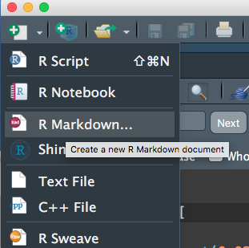
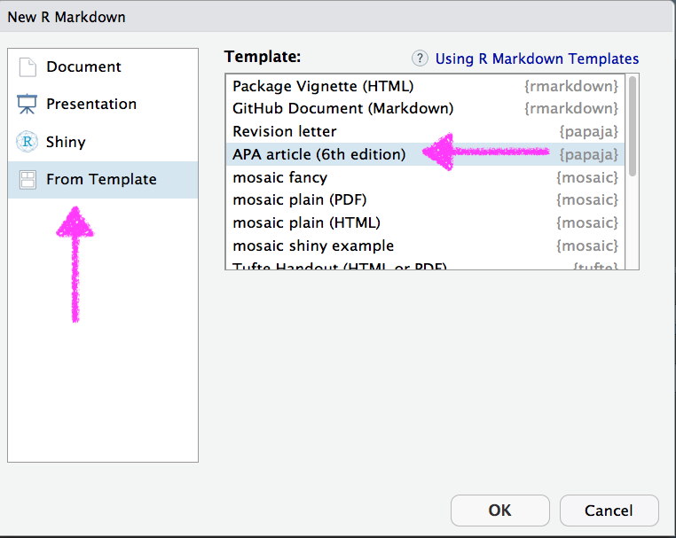
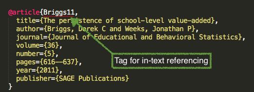
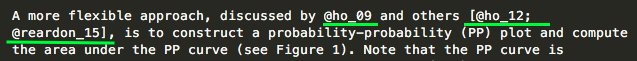
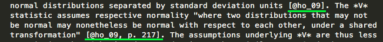
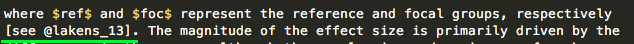
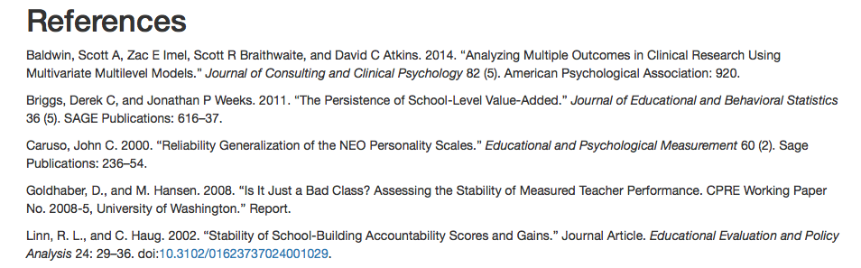

```{r setup, include = FALSE}
library(tidyverse)
library(knitr)
opts_chunk$set(warning = FALSE, message = FALSE)
```

# Agenda 

# Last two hours
- Advanced R Markdown functionality (10:15 - 11:00 minutes)
  - Formatting tables (20 min.) <!-- DA -->
  - Creating manuscripts to submit for publication (via {papaja}; 25 min.)

- Use of git/GitHub for version control and collaboration (11:00 - 11:45)
  - Introduction to GitHub, RStudio interface, and GitKraken GUI (20
  min.) <!-- DA -->
  - Making changes, committing them, and pushing them to the repository (15 min.) <!-- DA -->
  - Use of GitHub (and ignoring specific files via `.gitignore`; 10 min.) <!-- JMR -->

- Wrap-up/ideas for next steps/staying in touch (11:45 - 12:00)

---


class: da center middle
# R Markdown Tables 


<br>

### 10:15 - 10:35am

---
class: inverse
background-image:url(https://github.com/rstudio/gt/raw/master/man/figures/logo.svg?sanitize=TRUE)
background-size: contain

---
# Overview
* New package (still very actively under development) by RStudio

* Really promising
  + Pipe-oriented
  + Beautiful tables easy
  + Spanner heads/grouping used to be a total pain - not so anymore
  + Renders to HTML/PDF without even thinking about it

* May run into bumps because of the active development

---
# Install

```{r install-gt, eval = FALSE}
remotes::install_github("rstudio/gt")
```

---
# The hard part
* Getting your data in the format you want a table in

* Utilize your `gather`/`spread` skills regularly

```{r flying}
library(fivethirtyeight)
flying
```

---
```{r flying2}
smry <- flying %>% 
  count(gender, age, recline_frequency) %>% 
  filter(!is.na(age),
         !is.na(recline_frequency)) %>% 
  spread(age, n) 

smry
```


---
# Turn into table
### Disclaimer 
These all look slightly different on the slides

.pull-left[
```{r gt1-echo, eval = FALSE}
library(gt)
smry %>% 
  gt()
```
]

.pull-right[
```{r gt1-eval, echo = FALSE}
library(gt)
smry %>% 
  gt()
```
]

---
## Add gender as a grouping variable

.pull-left[
```{r gt2-echo, eval = FALSE}
smry %>% 
  group_by(gender) %>% 
  gt()
```
]

.pull-right[
```{r gt2-eval, echo = FALSE}
smry %>% 
  group_by(gender) %>% 
  gt()
```
]

---
# Add a spanner head

```{r gt3-echo, eval = FALSE}
smry %>% 
  group_by(gender) %>% 
  gt() %>% 
  tab_spanner(label = "Age Range",
              columns = vars(`18-29`, `30-44`, `45-60`, `> 60`))
```

---
```{r gt3-eval, echo = FALSE}
smry %>% 
  group_by(gender) %>% 
  gt() %>% 
  tab_spanner(label = "Age Range",
              columns = vars(`18-29`, `30-44`, `45-60`, `> 60`))
```

---
# Change column names

```{r gt4-echo, eval = FALSE}
smry %>% 
  group_by(gender) %>% 
  gt() %>% 
  tab_spanner(label = "Age Range",
              columns = vars(`18-29`, `30-44`, `45-60`, `> 60`)) %>% 
  cols_label(recline_frequency = "Recline")
```

---
```{r gt4-eval, echo = FALSE}
smry %>% 
  group_by(gender) %>% 
  gt() %>% 
  tab_spanner(label = "Age Range",
              columns = vars(`18-29`, `30-44`, `45-60`, `> 60`)) %>% 
  cols_label(recline_frequency = "Recline")
```

---
# Align columns

```{r gt4-aligned-echo, eval = FALSE}
smry %>% 
  group_by(gender) %>% 
  gt() %>% 
  tab_spanner(label = "Age Range",
              columns = vars(`18-29`, `30-44`, `45-60`, `> 60`)) %>% 
  cols_label(recline_frequency = "Recline") %>% 
  cols_align(align = "left", columns = vars(recline_frequency))
```

---
```{r gt4-aligned-eval, echo = FALSE}
smry %>% 
  group_by(gender) %>% 
  gt() %>% 
  tab_spanner(label = "Age Range",
              columns = vars(`18-29`, `30-44`, `45-60`, `> 60`)) %>% 
  cols_label(recline_frequency = "Recline") %>% 
  cols_align(align = "left", columns = vars(recline_frequency))
```

---
# Add a title

```{r gt4-title-echo, eval = FALSE}
smry %>% 
  group_by(gender) %>% 
  gt() %>% 
  tab_spanner(label = "Age Range",
              columns = vars(`18-29`, `30-44`, `45-60`, `> 60`)) %>% 
  cols_label(recline_frequency = "Recline") %>% 
  cols_align(align = "left", columns = vars(recline_frequency)) %>% 
  tab_header(title = "Airline Passengers",
             subtitle = "Leg space is limited, what do you do?")
```

---
```{r gt4-title-eval, echo = FALSE}
smry %>% 
  group_by(gender) %>% 
  gt() %>% 
  tab_spanner(label = "Age Range",
              columns = vars(`18-29`, `30-44`, `45-60`, `> 60`)) %>% 
  cols_label(recline_frequency = "Recline") %>% 
  cols_align(align = "left", columns = vars(recline_frequency)) %>% 
  tab_header(title = "Airline Passengers",
             subtitle = "Leg space is limited, what do you do?")
```

---
# Format columns

```{r gt5-echo, eval = FALSE}
smry %>% 
  mutate_at(vars(`18-29`, `30-44`, `45-60`, `> 60`), ~./100) %>% 
  group_by(gender) %>% 
  gt() %>% 
  tab_spanner(label = "Age Range",
              columns = vars(`18-29`, `30-44`, `45-60`, `> 60`)) %>% 
  fmt_percent(vars(`18-29`, `30-44`, `45-60`, `> 60`),
              decimals = 0) %>% 
  cols_label(recline_frequency = "Recline") %>% 
  cols_align(align = "left", columns = vars(recline_frequency)) %>% 
  tab_header(title = "Airline Passengers",
             subtitle = "Leg space is limited, what do you do?")
```

---
```{r gt5-eval, echo = FALSE}
smry %>% 
  mutate_at(vars(`18-29`, `30-44`, `45-60`, `> 60`), ~./100) %>% 
  group_by(gender) %>% 
  gt() %>% 
  tab_spanner(label = "Age Range",
              columns = vars(`18-29`, `30-44`, `45-60`, `> 60`)) %>% 
  fmt_percent(vars(`18-29`, `30-44`, `45-60`, `> 60`),
              decimals = 0) %>% 
  cols_label(recline_frequency = "Recline") %>% 
  cols_align(align = "left", columns = vars(recline_frequency)) %>% 
  tab_header(title = "Airline Passengers",
             subtitle = "Leg space is limited, what do you do?")
```

---
# Add a source note

```{r gt6-echo, eval = FALSE}
smry %>% 
  mutate_at(vars(`18-29`, `30-44`, `45-60`, `> 60`), ~./100) %>% 
  group_by(gender) %>% 
  gt() %>% 
  tab_spanner(label = "Age Range",
              columns = vars(`18-29`, `30-44`, `45-60`, `> 60`)) %>% 
  fmt_percent(vars(`18-29`, `30-44`, `45-60`, `> 60`),
              decimals = 0) %>% 
  cols_label(recline_frequency = "Recline") %>% 
  cols_align(align = "left", columns = vars(recline_frequency)) %>% 
  tab_header(title = "Airline Passengers",
             subtitle = "Leg space is limited, what do you do?") %>% 
  tab_source_note(source_note = md("Data from [fivethirtyeight](https://fivethirtyeight.com/features/airplane-etiquette-recline-seat/)"))
```

---
```{r gt6-eval, echo = FALSE}
smry %>% 
  mutate_at(vars(`18-29`, `30-44`, `45-60`, `> 60`), ~./100) %>% 
  group_by(gender) %>% 
  gt() %>% 
  tab_spanner(label = "Age Range",
              columns = vars(`18-29`, `30-44`, `45-60`, `> 60`)) %>% 
  fmt_percent(vars(`18-29`, `30-44`, `45-60`, `> 60`),
              decimals = 0) %>% 
  cols_label(recline_frequency = "Recline") %>% 
  cols_align(align = "left", columns = vars(recline_frequency)) %>% 
  tab_header(title = "Airline Passengers",
             subtitle = "Leg space is limited, what do you do?") %>% 
  tab_source_note(source_note = md("Data from [fivethirtyeight](https://fivethirtyeight.com/features/airplane-etiquette-recline-seat/)"))
```

---
# Color cells
```{r gt7-echo, eval = FALSE}
smry %>% 
  mutate_at(vars(`18-29`, `30-44`, `45-60`, `> 60`), ~./100) %>% 
  group_by(gender) %>% 
  gt() %>% 
  tab_spanner(label = "Age Range",
              columns = vars(`18-29`, `30-44`, `45-60`, `> 60`)) %>% 
  fmt_percent(vars(`18-29`, `30-44`, `45-60`, `> 60`),
              decimals = 0) %>% 
  cols_label(recline_frequency = "Recline") %>% 
  data_color(vars(`18-29`, `30-44`, `45-60`, `> 60`),
             colors = scales::col_numeric(palette = c(c("#FFFFFF", "#FF0000")), domain = NULL)) %>% 
  cols_align(align = "left", columns = vars(recline_frequency)) %>% 
  tab_header(title = "Airline Passengers",
             subtitle = "Leg space is limited, what do you do?") %>% 
  tab_source_note(source_note = md("Data from [fivethirtyeight](https://fivethirtyeight.com/features/airplane-etiquette-recline-seat/)"))
```

---
```{r gt7-eval, echo = FALSE}
smry %>% 
  mutate_at(vars(`18-29`, `30-44`, `45-60`, `> 60`), ~./100) %>% 
  group_by(gender) %>% 
  gt() %>% 
  tab_spanner(label = "Age Range",
              columns = vars(`18-29`, `30-44`, `45-60`, `> 60`)) %>% 
  fmt_percent(vars(`18-29`, `30-44`, `45-60`, `> 60`),
              decimals = 0) %>% 
  cols_label(recline_frequency = "Recline") %>% 
  data_color(vars(`18-29`, `30-44`, `45-60`, `> 60`),
             colors = scales::col_numeric(palette = c(c("#FFFFFF", "#FF0000")), domain = NULL)) %>% 
  cols_align(align = "left", columns = vars(recline_frequency)) %>% 
  tab_header(title = "Airline Passengers",
             subtitle = "Leg space is limited, what do you do?") %>% 
  tab_source_note(source_note = md("Data from [fivethirtyeight](https://fivethirtyeight.com/features/airplane-etiquette-recline-seat/)"))
```

---
# What else?
.pull-left[
* Lots more it can do, and lots more in development
* See the [website](https://gt.rstudio.com)
]

--
.pull-right[
gtcars case study is worth going through

]


---
class: da center middle
# APA Manuscripts 
## 10:35 - 11:00 am

---
# {papaja}

Despite having been around for  about 4 years 
[{papaja}](https://github.com/crsh/papaja) is still not on CRAN. 

More evidence that some of the best packages are not on CRAN.


--
Install with devtools

```{r install, eval = FALSE}
devtools::install_github("crsh/papaja")
```

---
# WIP

The package is seemingly perpetually under development. What does this mean?

--
* Re-install regularly.

--
* Not everything may work perfect - don't worry though, most things do

--
* You may want to peruse the current [issues](https://github.com/crsh/papaja/issues)
  + If you run into one (and you're sure it's an issue) consider opening one
  yourself
  + Bonus - the developer is very kind, so even if you open up a silly 
  issue, he's likely to be understanding

---
# Use the template

.pull-left[

]

.pull-right[

]

---
# YAML
A few more options than the default

<div>

</div>


---
# First thing - Render!

<div>

</div>

---
# Modifications
* Obvious ones
  + title
  + author & author info
  + abstract
  + keywords

--
* Less obvious
  + `shorttitle` (running head)
  + `authornote` (can fully delete or modify)
  + `wordcount` (fairly useless at this point imo)
  + `bibliography` (we'll talk more about this momentarily)
  + `linenumbers`
  + floats 
  + mask (for blind peer-review)
  + `classoption`

---
# Let's play for a minute!
Modify some of the options on the previous slide. 

Specifically, try changing `classoption` from `man` to `jou`. Try other things
too.


---
# Add some LaTeX options

```
header-includes:
  - \raggedbottom
  - \setlength{\parskip}{0pt}
```

This will help .gray[(save you lots of time googling)] remove the extra space
between paragraphs.


---
class: da center middle
# git/GitHub 
## An Introduction

<br>

### 11:00 - 11:40am

More info can be found here: http://www.datalorax.com/vita/ds/ds1-slides/w4p2/

---
class: inverse middle
background-image:url(img/final-doc.png)
background-size:contain

.footnote[“Piled Higher and Deeper” by Jorge Cham, http://www.phdcomics.com]


---
### From swcarpentry


We can think of the changes as separate from the document

---


This means there are many possible versions of the same document

---


Unless there are conflicts, two changes from the same document can be merged
together

<!-- Show repo for NCME pres & talk about publishing -->

---
class: inverse middle center
# How?
That's what we'll do today!

---
# Some basic terminology
* Version Control System
  + A tool to help us track changes. *git* is one such system.

--
* Commit
  + Changes that have been made to the file(s)

--
* Repository (repo)
  + Entire project (including history)

--
* Clone
  + Download files locally

--
* Pull
  + Get latest changes

--
* Push
  + Send latest commits to remote repo

---
# Demo (30 minutes)
### Goal: Get your work from this morning in a GitHub repo!
* Create new repo
* Clone it locally
* Add your files
* Commit
* Push
* Publish

---
class: jmr center middle
# Using GitHub

### 11:35 - 11:45am

---

# Example

### tidyLPA

[tidyLPA R package](https://github.com/data-edu/tidyLPA)

---
# Ignoring Files
* When we initialized the repo, we started it with a `.gitignore` file
* The `.gitignore` file tells the repo not to track certain files
  + e.g., proprietary data

---
class: inverse center middle
# Wrapping up

### 11:45am - 12:00pm

Daniel Anderson
- [daniela@uoregon.edu](mailto:daniela@uoregon.edu)
- [@datalorax_](https://twitter.com/datalorax_)
Joshua Rosenberg
-[jmrosenberg@utk.edu](mailto:jmrosenberg@utk.edu)
-[@jrosenberg6432][https://twitter.com/jrosenberg6432]

Mailing list: [rr-in-edu@googlegroups.com](rr-in-edu@googlegroups.com)

**Questions? Ideas? Thank you!**

---
class: inverse center middle
# Appendix


---
class: inverse middle center
# Citations

---
## Citations
To include references in your paper, you must:
* Create an external .bib file using LaTeX formatting (we'll get to this)
* Include `bibliography: nameOfYourBibFile.bib` in your YAML front matter.
* Refer to the citations in text using `@`

---
# Creating a .bib doc


--
<div>

</div>


---


--




---
# In text citations

```{r inTextCitesTable, echo = FALSE}
style <- c("@Briggs11", "[see @Baldwin2014; @Caruso2000]", "[@Linn02, p. 9]", 
          "[-@Goldhaber08]")
out <- c("Briggs and Weeks (2011)", "(see Baldwin et al. 2014; Caruso 2000)",
         "(Linn and Haug 2002, 9)", "(2008)")
knitr::kable(data.frame(style, out), 
        col.names = c("Citation Style", "Output"),
        format = "html")
```
<br>

Note this is not APA. However, references are included automatically at the end of the document. Include `# References` as the last line of your document to give it a title.

---
## A few real examples




---
## References


