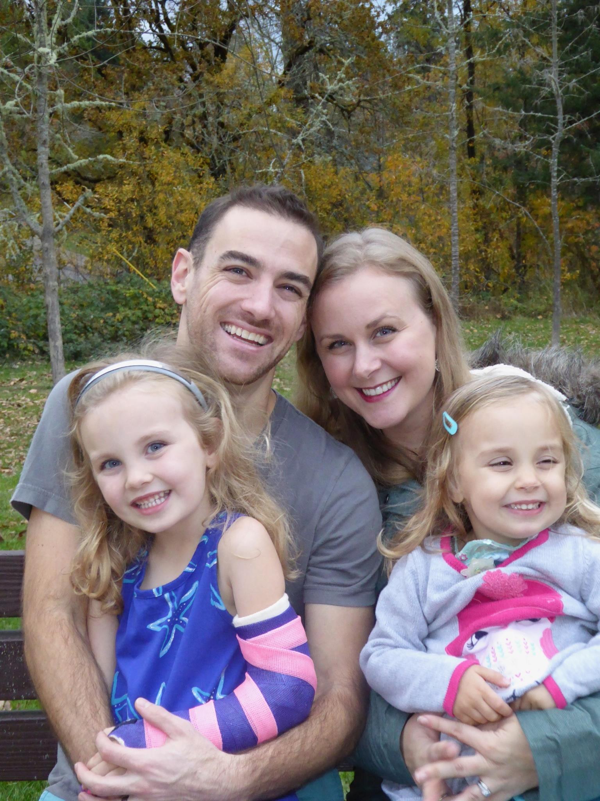
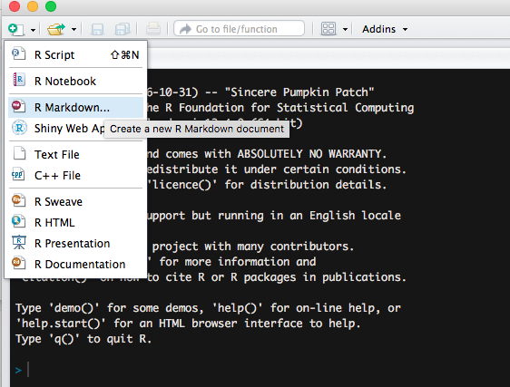
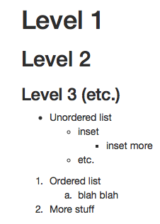
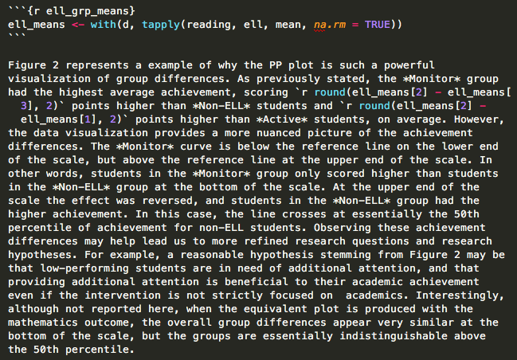
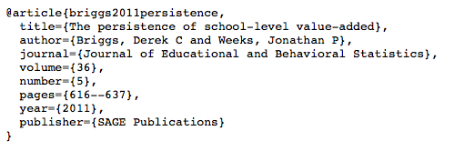
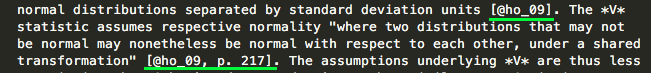
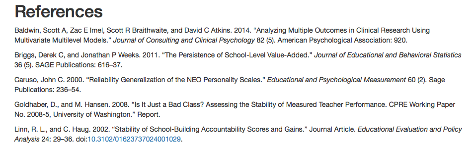
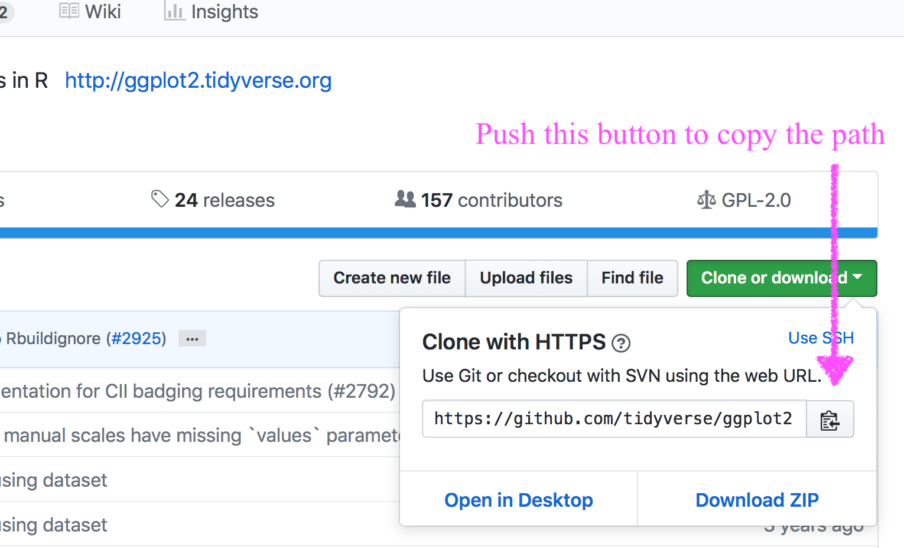
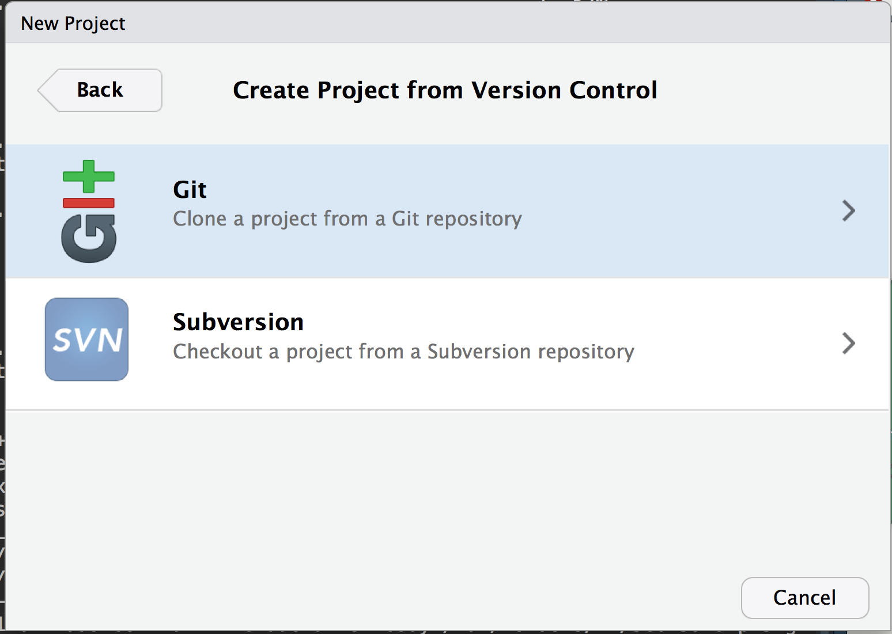

class: inverse
background-image:url(https://media.giphy.com/media/yoJC2A59OCZHs1LXvW/giphy.gif)
background-size:contain

```{r setup, include = FALSE}
library(knitr)
library(tidyverse)
```


---
# Agenda 

### First two hours
- Introduction (8:00 - 8:40)
  - Who we are, who participants are and why they're here (10 min.)
  - Reproducible research and literate programming (20 min.)
  - Conducting science in the public and in an open way (10 min.)

--
- R Markdown (8:40 - 9:40)
  - Delineating code chunks from plain text (10 min.)
  - Creating headers (10 min.)
  - Creating lists and using other features of markdown (10 min.)
  - Whole-document and code chunk-specific options (10 min.)
  - Rendering and sharing documents in different formats (20 min.)

--
- Advanced R Markdown functionality (9:40 - 10:00 minutes)
  - Formatting tables (10 min.)
  - Creating manuscripts to submit for publication (via {papaja} & {tinytex}; 10 min.)

---
class:inverse right
background-image:url(img/break.jpg)
background-size:cover

# Break (10:00 - 10:15)


---
### Last two hours
- Use of git/GitHub for version control and collaboration (10:15 - 11:15)
  - Introduction to GitHub, RStudio interface, and GitKraken GUI (15
  min.) 
  - Creating a git repository (15 min.)
  - Making changes, committing them, and pushing them to the repository (15 min.)
  - Use of GitHub (and ignoring specific files via `.gitignore`; 15 min.)

--
- Use of Open Science Framework to store private data (11:15 - 11:30; JMR)

--
- Creation of websites and dashboards (11:30 - 11:45 min.; DJA)

--
- Wrap-up/ideas for next steps/staying in touch (11:45 - 12:00)

---
# #whoami

.pull-left[
* Research Assistant Professor: Behavioral Research and Teaching, University of
Oregon ([#goducks](https://twitter.com/search?q=%23goducks&src=typd))
* Dad (two daughters: 6 (almost 7) and 4)
* Primary areas of interest
  + 💗💗R💗💗 and computational research 
  + Open data, open science, and reproducible workflows
  + Growth modeling, achievement gaps, and variance
    between educational institutions (particularly spatially)
]

```{r, out.width = "350px", echo = FALSE, fig.align = "center"}

```


---
# #whoami 2

[Josh stuff]


---
class: inverse bottom right
background-image: url(https://images.pexels.com/photos/1385627/pexels-photo-1385627.jpeg?auto=compress&cs=tinysrgb&dpr=2&h=750&w=1260)
background-size: cover

# #whoyouis


---
class: da center middle
# This slide means we're 
# transitioning to Daniel

---
class: jmr center middle
# This slide means we're 
# transitioning to Josh

---
class: da center middle
# Reproducible Research and
# Literate Programming

<br>

### 8:10 - 8:30


---
# A couple caveats 
* Much of what I'm going to be discussing represents an ideal that I have only recently begun working towards.

--

* None of what I will talk about should be taken as a referendum on you or
  your current practices. However, I hope to convince you that you should be working toward the reproducible research ideal, and that, as a field, we should be moving toward reproducible research being the *minimal standard*.


--
* I will be focusing on reproducible research with R (obviously). Other
  options are available but, in my view, none are as clear, comprehensive, and easy to implement as the tools at your disposal through R.

---
# What is reproducible research?
* .bolder[Replicability] is the gold standard for research. Ideally, most
research would be verified through replication. 


--
* Reproducibility represents a .bolder[minimal] standard, which itself can aid replication (tremendously), by conducting and documenting the research sufficiently that .blue[an independent researcher could reproduce all the results from a study], provided the data were available


--
* Turns out this is a more difficult standard than we would generally like to admit.

---
# Why should we care?
* Reproducibility as an ethical standard

  + More transparency
  + More potential for results to be verified (and errors found/corrected)


--
* If your work **is not** reproducible, it is often not truly replicable.


--
* If your work **is** reproducible, then others have a "recipe" for replication


---
# Are journal articles research? 
* Initially, we may think of journal articles as research, but really the
  research is everything that went into the article, not the article itself. 


--
* Some (Buckheit & Donoho, 2015) conceive of the article as the
  "advertisement".

--
* If all we have is the advertisement, can we really fully understand the
  steps and decisions made during the research?
    + In large-scale data analysis, the answer is generally "no".  

---
# The Duke Reproducibility Crisis
* 2006 investigation into "personalized" medicine.

  + Can genetic makeup be used to identify therapeutic regimes?


--
* Study claimed success, published in *Nature Medicine*
  + Deemed a "remarkable breakthrough"
  + Named one of the top publications of 2006 by *Discover*
  + Provided hope for cancer patients


--
* Original research article was followed by others in high-tier high-impact journals


--
* Other excited researchers asked for their data and code


--
* Analysis was found to be almost entirely not reproducible

---
# Is this a big deal? Is it isolated?
* Between 2000 and 2010, a *conservative* estimate of 80,000 patients participated in clinical trials based on research that was incorrect, with papers retracted. (Ince, 2011)


--
* We have an ethical responsibility to be transparent in our process and ensure that any reported findings are reproducible 


--
* Reproducibility does not imply "correctness", it implies transparency

---
# Tangential benefits
Striving toward reproducible research will:
* Make your own code more efficient/easily interpretable

  + Can help with collaboration on a project

* Reduce errors

* Increase efficiency by not having to redo tables and figures with each tweak
  to a model.

---
# What does literate programming look like?
### What this workshop is about!

--
1. Start with a basic text document (not Word, text)


--
2. Use the text document to write your article


--
3. Embed code within the text document that corresponds to your analysis. Note
  this is not just copying the code in. The code should be live and what you're working with while conducting your research.


--
4. Render the document into a different format (pdf, html, etc.).
  + Select which code (if any) will be displayed
  + Build tables of results and plots to be produced


---
# End result
* Readers can then read the "advertisement", but if they are interested 
  in reproducing your results they can access the text file that contains the analysis code.

* Single product that has the advertisement and the research process embedded.

---
# Other reasons dynamic documents are useful
Outside of reproducibility, you may want to use R Markdown to:
* Produce slides

* Keep track of your analysis (notes, essentially), even if you end up using 
  something like Word

* Share code with others

* Quickly share results with others

* Produce professional looking data products


---
# Challenges
* Word is the industry standard (frustratingly so, to me) 
  + Word output is less than ideal
* Can be difficult when collaborating with others
* Some journal articles *require* papers submitted in Word
  + Potentially get a pdf to word converter, but still less than ideal
* Advanced features have a relatively steep learning curve

---
class: jmr center middle
# Conducting public 
# and open science

<br>

### 8:30 - 8:40


---
class: jmr center middle
# R Markdown basics 
## Code Chunks & headers

<br>

### 8:40 - 9:00


---
# R Markdown
From within your R Studio Project:


---
# First thing: Render!


---
class: inverse center middle
# Create new R Markdown doc

### Demo


---
# YAML Front Matter

```
---
title: Example Markdown document
author: 
  - Daniel Anderson
  - Joshua M. Rosen
date: "2019-05-07"
---
```


* Three dashes before and after the YAML fields
* Case sensitive
* Many other fields are possible.
  + For example, you may want to include an `output:` argument (`pdf_document`,
    `html_document`, `word_document`). Must be specified as it is rendered, if
    not supplied.


---
# Example: Change syntax highlighting
The YAML will control a lot of how a document looks. For example, if you wanted to render with a different syntax highlighter:

.pull-left[
### Standard Rmd

```
---
title: "Doc Title"
output: pdf_document
---
```
]


.pull-right[
### kate 

```
---
title: "Doc Title"
output: 
  pdf_document:
    highlight: kate
---
```
]

---

---
# Code chunks versus text


---
# Code chunks

Start a code chunk with ` ```{r}`, then produce some r code, then close the

  chunk with three additional back ticks ` ``` `.


--

```{r add}
a <- 3
b <- 5

a + b * (exp(a)/b)
```


---
class: da center middle
# R Markdown basics 
## Lists & chunk options

<br>

### 9:00 - 9:20


---
# Headings and Lists 
### Not R-lists

.pull-left[

```
# Level 1
## Level 2 
### Level 3 (etc.)
```

<br/>

```
 * Unordered list
  - inset
    + inset more
  - etc.

1. Ordered list
  a. blah blah
2. More stuff
```

]

.pull-right[



]


---
# echo and eval

.pull-left[

You can show code without evaluating it, using `eval = FALSE`. 

<div align = "left">

</div>


```{r rCalc2, eval = FALSE}
a + b * (exp(a)/b)
```
]

.pull-right[

Alternatively, you can evaluate the code without displaying it, using `echo = 
  FALSE`.

<div align = "left">

</div>

```{r plotExample, echo = FALSE, fig.width = 11}
data(mtcars)
with(mtcars, plot(mpg, hp, 
  xlab = "Miles Per Gallon", 
  ylab = "Horsepower",
  main = "Relation between Miles Per Gallon and Horsepower"))
```

]

---
# warning

```{r loadggplot, include = FALSE}
library(ggplot2)
theme_set(theme_minimal(base_size = 25))
```

### Warning = `FALSE`
```{r ggplotWarning2, warning = FALSE, fig.height = 5}
ggplot(msleep, aes(sleep_rem, sleep_total)) + 
  geom_point()
```
Warning is printed to the console when rendering.


---

### Warning = `TRUE`
```{r ggplotWarning1, fig.height = 6, warning = TRUE}
ggplot(msleep, aes(sleep_rem, sleep_total)) + 
  geom_point()
```

---
# Show errors

`error = TRUE`
```{r showErrors, fig.show = "hide", error = TRUE}
ggplot(msleep, aes(sleep, sleep_total)) + 
  geom_point()
```

--

<br>

If `error = FALSE`, the document won't render if it encounters an error.


---
# Message
Some functions will return messages. You may want to suppress these.

### message = `FALSE`
```{r messages2, message = FALSE, fig.height = 4}
ggplot(msleep, aes(sleep_total)) +
  geom_histogram()
```

---
# Message

### message = `TRUE`
```{r messages1, fig.height = 5, message = TRUE}
ggplot(msleep, aes(sleep_total)) +
  geom_histogram()
```

---
# include


The `include` argument is used to evaluate code that is not included in the
document at all. For example, when setting up your global options.


---
# Setting global options
Change the default behavior

```{r globalOps1, eval = FALSE}
opts_chunk$set(options)
```

For example, you can set `echo = FALSE` and `fig.width = 6.5` and `fig.height = 8` with the following code.

```{r globalOps2, eval = FALSE}
opts_chunk$set(echo = FALSE, fig.width = 6.5, fig.height = 8)
```

This is most useful when producing a report for somebody who doesn't use R and has no use or knowledge of the code.


You can always override the global options within a particular chunk, e.g.

` ```{r, chunkName, echo = TRUE}` 

` ``` `

---
## Other things to consider setting globally:
* `warnings = FALSE`
* `message = FALSE`
* `errors = TRUE`
* `echo = FALSE`
* Caching options (next slides)


---
# More complete chunk options

```{r chunkOptions1, echo = FALSE, results = "asis"}
library(knitr)
library(kableExtra)
ops <- c("eval", "echo", "results", "warning", "error", "message", "include", 
            "tidy", "cache", "cache.comments", "dependson", "autodep", "fig.height/fig.width", "fig.show", "interval")
args <- c("logical", "logical", "markup, asis, hold, hide", 
            "logical", "logical", "logical", "logical", "logical", 
            "logical, 0:3", "logical", 
            "char, num", "logical", "numeric",
            "asis, hold, animate, hide", "numeric")
default <- c("TRUE", "TRUE", "markup", "TRUE", "TRUE", "TRUE", "TRUE",
              "FALSE", "FALSE", "NULL", "NULL", "FALSE", "7, 7", "asis", "1")
result <- c("Evaluate the code?", "Show the code?", "Render the results",
              "Print warnings?", "Preserve errors? (if FALSE, quit)", 
              "Print any messages?",
              "Include any of the code or output or code?", 
              "Tidy code? (see formatR package)", "Cache code chunks?",
              "Cache invalidated by comment changes?",
              "Current chunk depend on prior cached chunks?",
              "Depends determined automatically? ",
              "Height and width of figure", 
              "How the figure should be displayed", 
              "Animate speed")
kable(data.frame(ops, args, default, result)[1:8, ], 
      col.names = c("Options", "Arguments", "Default", "Result"),
      format = "html") %>%
  kable_styling()
```

---
# (and a few more)

```{r chunkOptions2, echo = FALSE, results = "asis"}
knitr::kable(data.frame(ops, args, default, result)[9:15, ], 
  col.names = c("Options", "Arguments", "Default", "Result"))
```

.footnote[For complete documentation, see http://yihui.name/knitr/options/]


---
# Inline code

A single back tick followed by `r` produces inline code to be evaluated.

<div align = "center">

</div>
<br>

This is an example of inline code, where I want to refer to the sum of `a` and
  `b`, which is `r a + b`.

This is *extremely* useful in writing reports. Never have to update any numbers in text, regardless of changes to your models or data (if you are careful about it).

---
# Real example




---
# Final Product

.pull-left[
<div >

</div>
]

.pull-right[
<div >

</div>
]


---
class: jmr center middle
# R Markdown basics 
## Render to different formats

<br>

### 9:20 - 9:40


---
class: da center middle
# Beyond the basics 
## Tables & APA manuscripts

<br>

### 9:40 - 10:00


---
# Chunk options
For tables, you may have to specify `results = "asis"` or you can end up with
something like 

```{r echo = FALSE}
papaja::apa_table(mtcars)
```

---
# Careful on formats
* Make sure you specify the format you want
  + PDF or HTML?


--
From `?kable`
* `format = "latex"` for PDF
* `format = "html"` for HTML output

---
class: inverse
background-image:url(https://github.com/rstudio/gt/raw/master/man/figures/logo.svg?sanitize=TRUE)
background-size: contain

---
# Overview
* New package (still very actively under development) by RStudio

* Really promising
  + Pipe-oriented
  + Beautiful tables easy
  + Spanner heads/grouping used to be a total pain - not so anymore
  + Renders to HTML/PDF without even thinking abou tit

* Has a few limitations relative to {papaja}

* May run into bumps because of the active development

---
# Install

```{r install-gt, eval = FALSE}
remotes::install_github("rstudio/gt")
```

---
# The hard part
* Getting your data in the format you want a table in

* Utilize your `gather`/`spread` skills regularly

```{r flying}
library(fivethirtyeight)
flying
```

---
```{r flying2}
smry <- flying %>% 
  count(gender, age, recline_frequency) %>% 
  filter(!is.na(age),
         !is.na(recline_frequency)) %>% 
  spread(age, n) 

smry
```


---
# Turn into table
### Disclaimer 
These all look slightly different on the slides

.pull-left[
```{r gt1-echo, eval = FALSE}
library(gt)
smry %>% 
  gt()
```
]

.pull-right[
```{r gt1-eval, echo = FALSE}
library(gt)
smry %>% 
  gt()
```
]

---
## Add gender as a grouping variable

.pull-left[
```{r gt2-echo, eval = FALSE}
smry %>% 
  group_by(gender) %>% 
  gt()
```
]

.pull-right[
```{r gt2-eval, echo = FALSE}
smry %>% 
  group_by(gender) %>% 
  gt()
```
]

---
# Add a spanner head

```{r gt3-echo, eval = FALSE}
smry %>% 
  group_by(gender) %>% 
  gt() %>% 
  tab_spanner(label = "Age Range",
              columns = vars(`18-29`, `30-44`, `45-60`, `> 60`))
```

---
```{r gt3-eval, echo = FALSE}
smry %>% 
  group_by(gender) %>% 
  gt() %>% 
  tab_spanner(label = "Age Range",
              columns = vars(`18-29`, `30-44`, `45-60`, `> 60`))
```

---
# Change column names

```{r gt4-echo, eval = FALSE}
smry %>% 
  group_by(gender) %>% 
  gt() %>% 
  tab_spanner(label = "Age Range",
              columns = vars(`18-29`, `30-44`, `45-60`, `> 60`)) %>% 
  cols_label(recline_frequency = "Recline")
```

---
```{r gt4-eval, echo = FALSE}
smry %>% 
  group_by(gender) %>% 
  gt() %>% 
  tab_spanner(label = "Age Range",
              columns = vars(`18-29`, `30-44`, `45-60`, `> 60`)) %>% 
  cols_label(recline_frequency = "Recline")
```

---
# Align columns

```{r gt4-aligned-echo, eval = FALSE}
smry %>% 
  group_by(gender) %>% 
  gt() %>% 
  tab_spanner(label = "Age Range",
              columns = vars(`18-29`, `30-44`, `45-60`, `> 60`)) %>% 
  cols_label(recline_frequency = "Recline") %>% 
  cols_align(align = "left", columns = vars(recline_frequency))
```

---
```{r gt4-aligned-eval, echo = FALSE}
smry %>% 
  group_by(gender) %>% 
  gt() %>% 
  tab_spanner(label = "Age Range",
              columns = vars(`18-29`, `30-44`, `45-60`, `> 60`)) %>% 
  cols_label(recline_frequency = "Recline") %>% 
  cols_align(align = "left", columns = vars(recline_frequency))
```

---
# Add a title

```{r gt4-title-echo, eval = FALSE}
smry %>% 
  group_by(gender) %>% 
  gt() %>% 
  tab_spanner(label = "Age Range",
              columns = vars(`18-29`, `30-44`, `45-60`, `> 60`)) %>% 
  cols_label(recline_frequency = "Recline") %>% 
  cols_align(align = "left", columns = vars(recline_frequency)) %>% 
  tab_header(title = "Airline Passengers",
             subtitle = "Leg space is limited, what do you do?")
```

---
```{r gt4-title-eval, echo = FALSE}
smry %>% 
  group_by(gender) %>% 
  gt() %>% 
  tab_spanner(label = "Age Range",
              columns = vars(`18-29`, `30-44`, `45-60`, `> 60`)) %>% 
  cols_label(recline_frequency = "Recline") %>% 
  cols_align(align = "left", columns = vars(recline_frequency)) %>% 
  tab_header(title = "Airline Passengers",
             subtitle = "Leg space is limited, what do you do?")
```

---
# Format columns

```{r gt5-echo, eval = FALSE}
smry %>% 
  mutate_at(vars(`18-29`, `30-44`, `45-60`, `> 60`), ~./100) %>% 
  group_by(gender) %>% 
  gt() %>% 
  tab_spanner(label = "Age Range",
              columns = vars(`18-29`, `30-44`, `45-60`, `> 60`)) %>% 
  fmt_percent(vars(`18-29`, `30-44`, `45-60`, `> 60`),
              decimals = 0) %>% 
  cols_label(recline_frequency = "Recline") %>% 
  cols_align(align = "left", columns = vars(recline_frequency)) %>% 
  tab_header(title = "Airline Passengers",
             subtitle = "Leg space is limited, what do you do?")
```

---
```{r gt5-eval, echo = FALSE}
smry %>% 
  mutate_at(vars(`18-29`, `30-44`, `45-60`, `> 60`), ~./100) %>% 
  group_by(gender) %>% 
  gt() %>% 
  tab_spanner(label = "Age Range",
              columns = vars(`18-29`, `30-44`, `45-60`, `> 60`)) %>% 
  fmt_percent(vars(`18-29`, `30-44`, `45-60`, `> 60`),
              decimals = 0) %>% 
  cols_label(recline_frequency = "Recline") %>% 
  cols_align(align = "left", columns = vars(recline_frequency)) %>% 
  tab_header(title = "Airline Passengers",
             subtitle = "Leg space is limited, what do you do?")
```

---
# Add a source note

```{r gt6-echo, eval = FALSE}
smry %>% 
  mutate_at(vars(`18-29`, `30-44`, `45-60`, `> 60`), ~./100) %>% 
  group_by(gender) %>% 
  gt() %>% 
  tab_spanner(label = "Age Range",
              columns = vars(`18-29`, `30-44`, `45-60`, `> 60`)) %>% 
  fmt_percent(vars(`18-29`, `30-44`, `45-60`, `> 60`),
              decimals = 0) %>% 
  cols_label(recline_frequency = "Recline") %>% 
  cols_align(align = "left", columns = vars(recline_frequency)) %>% 
  tab_header(title = "Airline Passengers",
             subtitle = "Leg space is limited, what do you do?") %>% 
  tab_source_note(source_note = md("Data from [fivethirtyeight](https://fivethirtyeight.com/features/airplane-etiquette-recline-seat/)"))
```

---
```{r gt6-eval, echo = FALSE}
smry %>% 
  mutate_at(vars(`18-29`, `30-44`, `45-60`, `> 60`), ~./100) %>% 
  group_by(gender) %>% 
  gt() %>% 
  tab_spanner(label = "Age Range",
              columns = vars(`18-29`, `30-44`, `45-60`, `> 60`)) %>% 
  fmt_percent(vars(`18-29`, `30-44`, `45-60`, `> 60`),
              decimals = 0) %>% 
  cols_label(recline_frequency = "Recline") %>% 
  cols_align(align = "left", columns = vars(recline_frequency)) %>% 
  tab_header(title = "Airline Passengers",
             subtitle = "Leg space is limited, what do you do?") %>% 
  tab_source_note(source_note = md("Data from [fivethirtyeight](https://fivethirtyeight.com/features/airplane-etiquette-recline-seat/)"))
```

---
# Color cells
```{r gt7-echo, eval = FALSE}
smry %>% 
  mutate_at(vars(`18-29`, `30-44`, `45-60`, `> 60`), ~./100) %>% 
  group_by(gender) %>% 
  gt() %>% 
  tab_spanner(label = "Age Range",
              columns = vars(`18-29`, `30-44`, `45-60`, `> 60`)) %>% 
  fmt_percent(vars(`18-29`, `30-44`, `45-60`, `> 60`),
              decimals = 0) %>% 
  cols_label(recline_frequency = "Recline") %>% 
  data_color(vars(`18-29`, `30-44`, `45-60`, `> 60`),
             colors = scales::col_numeric(palette = c(c("#FFFFFF", "#FF0000")), domain = NULL)) %>% 
  cols_align(align = "left", columns = vars(recline_frequency)) %>% 
  tab_header(title = "Airline Passengers",
             subtitle = "Leg space is limited, what do you do?") %>% 
  tab_source_note(source_note = md("Data from [fivethirtyeight](https://fivethirtyeight.com/features/airplane-etiquette-recline-seat/)"))
```

---
```{r gt7-eval, echo = FALSE}
smry %>% 
  mutate_at(vars(`18-29`, `30-44`, `45-60`, `> 60`), ~./100) %>% 
  group_by(gender) %>% 
  gt() %>% 
  tab_spanner(label = "Age Range",
              columns = vars(`18-29`, `30-44`, `45-60`, `> 60`)) %>% 
  fmt_percent(vars(`18-29`, `30-44`, `45-60`, `> 60`),
              decimals = 0) %>% 
  cols_label(recline_frequency = "Recline") %>% 
  data_color(vars(`18-29`, `30-44`, `45-60`, `> 60`),
             colors = scales::col_numeric(palette = c(c("#FFFFFF", "#FF0000")), domain = NULL)) %>% 
  cols_align(align = "left", columns = vars(recline_frequency)) %>% 
  tab_header(title = "Airline Passengers",
             subtitle = "Leg space is limited, what do you do?") %>% 
  tab_source_note(source_note = md("Data from [fivethirtyeight](https://fivethirtyeight.com/features/airplane-etiquette-recline-seat/)"))
```

---
# What else?
* Lots more it can do, and lots more in development
* See the [website](https://gt.rstudio.com)

--
* gtcars case study is worth going through

.pull-right[

]


---
# {papaja}

Despite having been around for  about 4 years 
[{papaja}](https://github.com/crsh/papaja) is still not on CRAN. 

More evidence that some of the best packages are not on CRAN.


--
Install with devtools

```{r install, eval = FALSE}
devtools::install_github("crsh/papaja")
```

---
# WIP

The package is seemingly perpetually under development. What does this mean?

--
* Re-install regularly.

--
* Not everything may work perfect - don't worry though, most things do

--
* You may want to peruse the current [issues](https://github.com/crsh/papaja/issues)
  + If you run into one (and you're sure it's an issue) consider opening one
  yourself
  + Bonus - the developer is very kind, so even if you open up a silly 
  issue, he's likely to be understanding

---
# Use the template

.pull-left[

]

.pull-right[

]

---
# YAML
A few more options than the default

<div>

</div>


---
# First thing - Render!

<div>

</div>

---
# Modifications
* Obvious ones
  + title
  + author & author info
  + abstract
  + keywords

--
* Less obvious
  + `shorttitle` (running head)
  + `authornote` (can fully delete or modify)
  + `wordcount` (fairly useless at this point imo)
  + `bibliography` (we'll talk more about this momentarily)
  + `linenumbers`
  + floats 
  + mask (for blind peer-review)
  + `classoption`

---
# Let's play for a minute!
Modify some of the options on the previous slide. 

Specifically, try changing `classoption` from `man` to `jou`. Try other things
too.


---
class: inverse middle center
# Citations

---
## Citations
To include references in your paper, you must:
* Create an external .bib file using LaTeX formatting (we'll get to this)
* Include `bibliography: nameOfYourBibFile.bib` in your YAML front matter.
* Refer to the citations in text using `@`

---
# Creating a .bib doc


--
<div>

</div>


---


--


---
# In text citations

```{r inTextCitesTable, echo = FALSE}
style <- c("@Briggs11", "[see @Baldwin2014; @Caruso2000]", "[@Linn02, p. 9]", 
          "[-@Goldhaber08]")
out <- c("Briggs and Weeks (2011)", "(see Baldwin et al. 2014; Caruso 2000)",
         "(Linn and Haug 2002, 9)", "(2008)")
knitr::kable(data.frame(style, out), 
        col.names = c("Citation Style", "Output"),
        format = "html")
```
<br>

Note this is not APA. However, references are included automatically at the end of the document. Include `# References` as the last line of your document to give it a title.

---
## A few real examples




---
## References



---
class: inverse center middle
# Break

### 10:00 - 10:15

---
class: da center middle
# git/GitHub 
## An Introduction

<br>

### 10:15 - 11:00

---
class: inverse middle
background-image:url(img/final-doc.png)
background-size:contain

.footnote[“Piled Higher and Deeper” by Jorge Cham, http://www.phdcomics.com]


---
### From swcarpentry


We can think of the changes as separate from the document

---


This means there are many possible versions of the same document

---


Unless there are conflicts, two changes from the same document can be merged
together

---
# How?
That's what we'll talk about today!

--

Goals: 
* Get you to understand the structure of git
* Actual method of completing the tasks is up to you
  + GUI? Command line? RStudio?

--
* If you go with a GUI, I'd recommend [GitKraken](https://www.gitkraken.com)
  + In fact, I'd recommend everybody download/use it, even if for merge
    conflicts alone.

---
# Some basic terminology
* Version Control System
  + A tool to help us track changes. *git* is one such system (but there
    are others).
--
* Commit
  + Changes that have been made to the file(s)

--
* Repository (repo)
  + The files, full commit history, and associated metadata for a project


--
### When working with git
* Each collaborator has the *entire* repo on their local machine
* There is also a cloud-based server hosing the repo (that's GitHub)
* The online version of the repo is call the *remote*

---
# Some key points

* Because *git* tracks the **entire** history of a project it is akin to
  unlimited "undo"
* *git* allows many people to work in parallel

---
# Creating a repository

* A couple of different options...


--
### Rstudio
Let's focus on the RStudio version first. 

---
# GitHub
Go to GitHub
* Select drop down by your profile, then "New Repository"
* I'd suggest also adding the R .gitignore and a README

<div >

</div>


---
# Name it

<div >

</div>


---
# Copy path



---
### Create a new RStudio Project


---



---


---


---
class: inverse center middle

# [demo]

Let's look atthe git plugin

---
# Tracking

Notice the hidden `.git` folder


--
On mac, show hidden files with

```
cmd + shift + .
```

(Note, I have hidden files shown all the time)

--

* As long as that folder exists, the **entire** folder will be
tracked.
  + **Do not create repos inside of repos**
  + If you want a folder to show up, there needs to be something in it (e.g., 
    a `README.md`)


---
# Ignoring Files
* When we initialized the repo, we started it with a `.gitignore` file
* The `.gitignore` file tells the repo not to track certain files
  + e.g., proprietary data


---
# Adding a file
* Let's create an R Markdown file and put it in our repo.
* Open terminal, type `git status`. What do you see?
* Use the RStudio `git` plugin. What do you see?

---
# Staging
* When you add files to a repo you are *staging* them for tracking.

[demo gitkraken & RStudio staging]


---
# Commits
After staging, you *commit* changes to the file


---
# Push
After you've committed the changes you want, push them to the remote

--


Wait what's a remote again?


--
The cloud-based repo

---
# Refresh the repo


---
class: inverse right
background-image:url(img/gitkraken.png)
background-size:cover

# gitkraken approach

---
# An overall view


---
# Revisiting some vocabulary
* stage
* commit
* push
* pull
* clone


--
At least half the difficulty with *git* is all the weird words


---
# Collaborating
Need to get proper permissions. Two methods:
* Add users to a repo: Settings => Collaborators => add user w/ username


---
# Collaborating
Second method: 
* Create an organization

<div >

</div>

---
# Cloning
Means you're downloading the repo

--
* Can also start a new RStudio project

--

```{bash, eval = FALSE}
git clone <path>
```

<div >

</div>

---
# Merge conflicts
* Remember to always `git pull` first
* Let's create a merge conflict!

(Note the GUI from *gitkraken* is really nice for resolving them)


---
# Advice on avoiding merge conflicts
* Always `git pull` (or the GUI equivalent) before you start working
* Try to stay in communication and don't work on the **exact** same thing at the same time
* Use a GUI to help you manage what merge conflicts you do run into

--
### Remember - this is an intro!

---


---
class: jmr center middle
# .gitignore 


<br>

### 11:00 - 11:15


---
class: jmr center middle
# OSF 


<br>

### 11:15 - 11:30


---
class: da center middle
# Advanced Rmd 
## Websites & dashboards

<br>

### 11:30 - 11:45


---
class:inverse center middle
# [demo]

---
class: inverse center middle
# Wrap up

